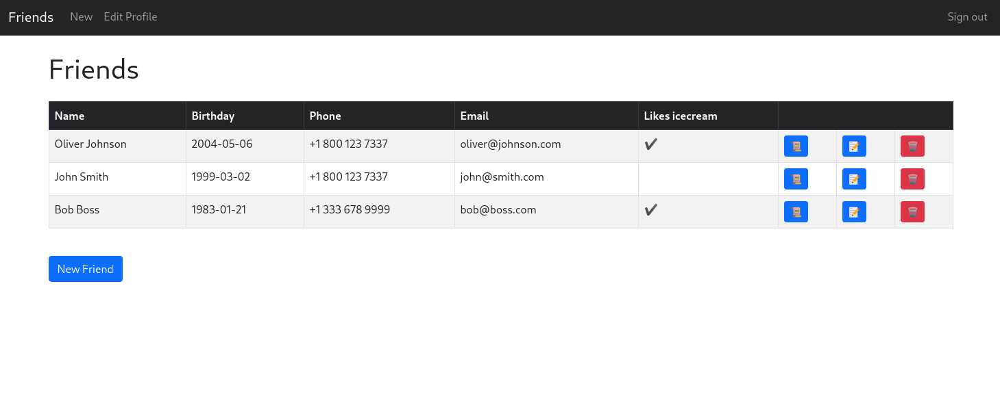
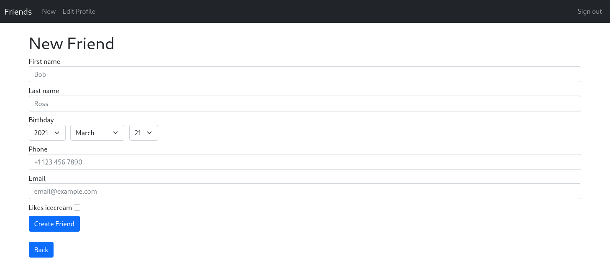
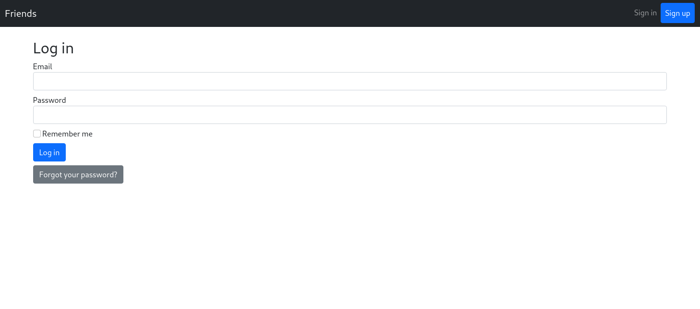
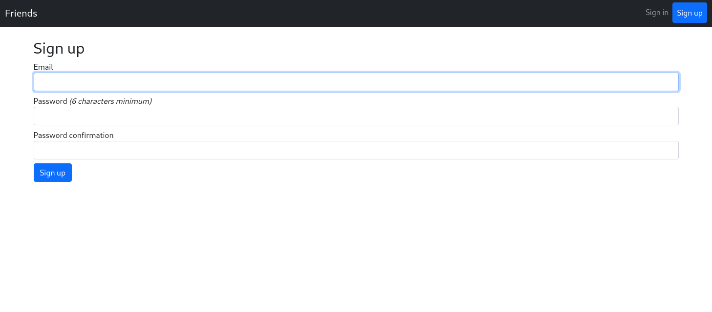

# Friends App
This is a full stack application made with Ruby on Rails 6. It is made with a tutorial made
available by FreeCodeCamp with some minor differences: https://youtube.com/watch?v=fmyvWz5TUWg

## Screenshots





## Run locally
You need to have rails installed
```sh
git clone https://github.com/lunush/rails-freecodecamp-tutorial
cd rails-freecodecamp-tutorial
rails server
```
